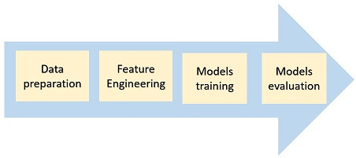

# Anomaly detection in LTE activity

## Objective
1. Apply 2 supervised learning models to detect anormalies in LTE activity dataset.
    * Decision Tree
    * XGBoost
2. Develop a simple GUI/web application to allow user interactivity with trained models. 

## Deliverables
Perform the following seperately:
1. Exploratory Data Analysis in Jupyter Notebook
2. End-to-end Machine Learning Pipeline (MLP) in Python Scripts
3. Simple GUI/web application in Python:
    - input: file containing test data
    - output: show model evaluation results  

Reproducibility for MLP is important:
* Don't develop MLP in an interactive notebook.
* Pipeline should be configurable to enable easy experimentation of different. You can consider the usage of a config file.  

  

In final report & presentation: Provide descriptions:
1. Appropriate data preprocessing and feature engineering
2. Appropriate use and optimization of algorithms/models
3. Explanation for the choice of algorithms/models
4. Explanation for the choice of evaluation metrics
    - Compare the 2 trained models using evaluation metrics  

## Suggested Reading
Book: Machine Learning Bookcamp  
Author: Alexey Grigorev  

| Chapter | Time Period |
|----------|----------|
| Appendix C, Appendix D, 1, 2 (EDA sections) | 12 Oct - 20 Oct |
| 3, 6.1, 6.2 (Decision Trees) | 23 Oct - 3 Nov |
| 4 | 6 Nov - 10 Nov |
| 6 | 13 Nov - 17 Nov |
| 5 (Pickle, Flask/FastAPI + Streamlit) | 27 Nov - 1 Dec |  

Book: Effective XGBoost  
Author: Matt Harrison  

| Chapter | Time Period |
|----------|----------|
| 4 - Tree Creation | 16 Oct - 20 Oct |
| 5 - Stumps| 23 Oct - 27 Oct |
| 6 - Model Complexity & Hyperparameters, 7 - Tree Hyperparameters | 30 Oct - 3 Nov |
| 9 - XGBoost, 10 - Early Stopping | 6 Nov - 10 Nov |
| 11 - XGBoost Hyperparameters| 13 Nov - 17 Nov |
| 12 - Hyperopt | 20 Nov - 24 Nov |  
| 13 - Step-wise tuning with Hyperopt | 27 Nov - 1 Dec |  

Data source: https://www.kaggle.com/competitions/anomaly-detection-in-4g-cellular-networks/overview